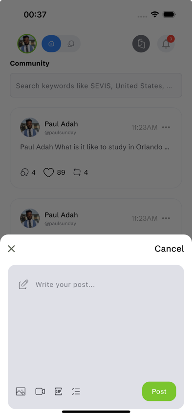
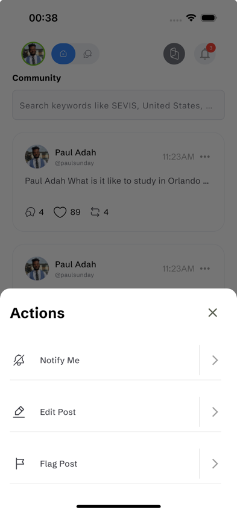

# Pay4Me Assessment

A Flutter application with community features, search functionality, and state management using
Riverpod.

## Project Overview

Pay4Me Assessment is a mobile application that showcases a community screen where users can:

- View community posts
- Search for countries and keywords
- Toggle between different tabs
- Create new posts
- Like and interact with existing posts

## Features

- **Community Feed**: View posts from community members with images and text content
- **Real-time Search**: Filter countries as you type
- **Tab Navigation**: Switch between different views using tab chips
- **Post Creation**: Create new posts using the floating action button

## Project Structure

```
pay4me_assessment/
├── lib/
│   ├── data/             # Data models and static assets references
│   ├── provider/         # Riverpod state management
│   │   ├── search_filter.dart
│   │   └── toggle_provider.dart
│   ├── utils/            # Utility classes
│   │   ├── app_colors.dart
│   │   ├── extensions.dart
│   │   ├── responsiveness.dart
│   │   └── screen_utils.dart
│   ├── views/            # UI screens
│   │   ├── components/   # Reusable UI components
│   │   └── community_screen.dart
│   └── widgets/          # Shared widgets
│       ├── custom_container.dart
│       ├── custom_text.dart
│       ├── gap.dart
│       └── spacer.dart
└── test/                 # Test files
    ├── cummunity_widget_test.dart
    └── widget_test.dart
```

## State Management

The application uses Riverpod for state management:

- `search_filter.dart`: Manages the country search functionality
- `toggle_provider.dart`: Handles tab selection and like button states

## Getting Started

### Prerequisites

- Flutter SDK (latest stable version)
- Dart SDK
- Android Studio / VS Code with Flutter extensions

### Installation

1. Clone the repository:

```bash
git clone https://github.com/yourusername/pay4me_assessment.git
```

2. Navigate to the project folder:

```bash
cd pay4me_assessment
```

3. Install dependencies:

```bash
flutter pub get
```

4. Run the app:

```bash
flutter run
```

## Testing

The application includes widget tests to ensure UI components work as expected. Run tests with:

```bash
flutter test
```

### Key Test Cases

- Tab navigation functionality
- Search filtering
- Modal display for post creation

## GitHub Actions Integration

This project uses GitHub Actions for continuous integration. On each push or pull request to the
main branch, the workflow:

1. Sets up the Flutter environment
2. Gets all dependencies
3. Runs widget tests
4. Reports test results
5. Fails the workflow if any tests fail

### GitHub Actions Setup

Create a `.github/workflows/flutter_ci.yml` file with the following content:

```yaml
name: Flutter CI

on:
  push:
    branches: [ main ]
  pull_request:
    branches: [ main ]

jobs:
  build:
    runs-on: ubuntu-latest
    steps:
      - uses: actions/checkout@v3

      - name: Setup Flutter
        uses: subosito/flutter-action@v2
        with:
          flutter-version: '3.27.3'
          channel: 'stable'

      - name: Install dependencies
        run: flutter pub get

      - name: Verify formatting
        run: dart format --output=none --set-exit-if-changed .

      - name: Analyze project source
        run: flutter analyze

      - name: Run tests
        run: flutter test --coverage

      - name: Upload coverage to Codecov
        uses: codecov/codecov-action@v3
        with:
          file: coverage/lcov.info
```

## Future Improvements

- Add authentication flow
- Implement notification system
- Create user profiles
- Add media upload capabilities
- Enable comment threads

## Contributing

1. Fork the Project
2. Create your Feature Branch (`git checkout -b feature/AmazingFeature`)
3. Commit your Changes (`git commit -m 'Add some AmazingFeature'`)
4. Push to the Branch (`git push origin feature/AmazingFeature`)
5. Open a Pull Request

## License

This project is licensed under the MIT License - see the LICENSE file for details.



 
